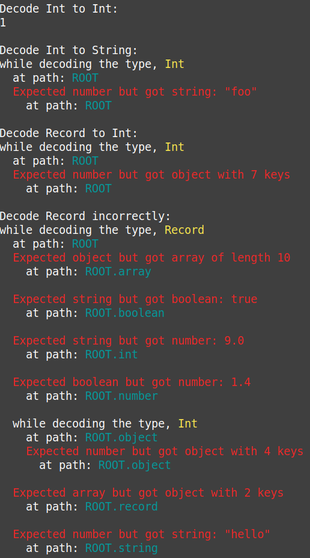

# purescript-json-codecs

A JSON codec library that supports value-based and configurable typeclass-based json codecs

## Design

Address gripes with other JSON codec libraries:
- [`simple-json`](https://pursuit.purescript.org/packages/purescript-simple-json/):
  - I don't want to have to [fork or copy the repo](https://github.com/justinwoo/purescript-simple-json#how-should-i-actually-use-this-library) to benefit from it / change various type class instances.
  - I don't want to use your information-poor error type, `NonEmptyList ForeignError`
- [`argonaut-codec`](https://pursuit.purescript.org/packages/purescript-argonaut-codecs)/[`codec-argonaut`](https://pursuit.purescript.org/packages/purescript-codec-argonaut):
  - I don't want to use your information-poor error type, `JsonDecodeError`
  - I want one library for value-based or typeclass-based codecs

Improve error messages:
- show me all failures, not just the first one (i.e. use `V`, not `Either`)
- show me hints separate from the error message
- on type mismatch errors, show me what you expected AND got, not just what was expected
- give me more control over what my error type is

Provide a single library for
  - both versions of codecs:
    - [x] class-based
      - [ ] configurable decoder - **WIP**
      - [ ] configurable encoder - **WIP**
    - [x] value-based
  - both directions of codecs:
    - [x] unidirectional (one can implement only encode/decode, and they can be different)
    - [ ] bidirectional (encode/decode must be bidirectional) - **WIP**
  - [ ] for migrating JSON using old/outdated codecs easily - **WIP**

Provide record syntax I enjoy using
  - See [the test folder's `Main.purs` for an example](./test/Main.purs).

Make it easy to drop newtypes when using typeclass-based codecs.
  - [ ] automatic removal of utility newtypes - **WIP**

See [DESIGN.md](DESIGN.md) for the reasoning behind this library's design.

## Error Messages for `test/Main.purs`

### `PrimitiveJsonError`:

```
Decode Int to Int:
1

Decode Int to String:
while decoding the type, Int
  at path: ROOT
Expected number but got string: "foo"
  at path: ROOT

Decode Record to Int:
while decoding the type, Int
  at path: ROOT
Expected number but got object with 7 keys
  at path: ROOT

Decode Record incorrectly:
while decoding the type, Record
  at path: ROOT
  Expected object but got array of length 10
    at path: ROOT.array
  Expected string but got boolean: true
    at path: ROOT.boolean
  Expected string but got number: 9.0
    at path: ROOT.int
  Expected boolean but got number: 1.4
    at path: ROOT.number
  while decoding the type, Int
    at path: ROOT.object
  Expected number but got object with 4 keys
    at path: ROOT.object
  Expected array but got object with 2 keys
    at path: ROOT.record
  Expected number but got string: "hello"
    at path: ROOT.string
```

### `Doc Void`

```
Decode Int to Int:
1

Decode Int to String:
while decoding the type, Int
  at path: ROOT
  Expected number but got string: "foo"
    at path: ROOT

Decode Record to Int:
while decoding the type, Int
  at path: ROOT
  Expected number but got object with 7 keys
    at path: ROOT

Decode Record incorrectly:
while decoding the type, Record
  at path: ROOT
  Expected object but got array of length 10
    at path: ROOT.array

  Expected string but got boolean: true
    at path: ROOT.boolean

  Expected string but got number: 9.0
    at path: ROOT.int

  Expected boolean but got number: 1.4
    at path: ROOT.number

  while decoding the type, Int
    at path: ROOT.object
    Expected number but got object with 4 keys
      at path: ROOT.object

  Expected array but got object with 2 keys
    at path: ROOT.record

  Expected number but got string: "hello"
    at path: ROOT.string
```

### `Doc GraphicsParam`

Same as `Doc Void` but with colors:



## Codec Examples

### Value-based codec where all fields are required

```purs
-- Error messages are outputted with color.
fooDecoder :: JsonDecoder (Doc GraphicsParam) _
fooDecoder =
  decodeRecord
    { a: ade $ decodeRecord
        { foo: decodeBoolean }
    , b: decodeEither decodeInt $ decodeArray decodeString
    , c: decodeMaybeTagged decodeString
    }

fooEncoder :: _ -> Json
fooEncoder =
  encodeRecord
    { a: encodeRecord
        { foo: encodeBoolean }
    , b: encodeEither encodeInt $ encodeArray encodeString
    , c: encodeMaybeTagged encodeString
    }
```

### Value-based codec where some fields are optional

```purs
{-
This decodes to
  { a :: { foo :: Boolean }
  , b :: Either Int (Array String)
  , c :: Maybe String
  , optionalA :: Maybe Int    -- decodes to Nothing if field is missing.
  , optionalB :: Maybe String -- decodes to Nothing if field is missing.
  }
-}
barDecoder :: JsonDecoder (Doc GraphicsParam) _
barDecoder =
  decodeRecord' $ buildRecordDecoder $
    decodeRequiredProps
      { a: ade $ decodeRecord
          { foo: decodeBoolean }
      , b: decodeEither decodeInt $ decodeArray decodeString
      , c: decodeMaybeTagged decodeString
      }
    >>> decodeOptionalProps
      { optionalA: decodeInt
      , optionalB: decodeString
      }

barEncoder :: Jsonencoder (Doc GraphicsParam) _
barEncoder =
  encodeRecord' $ buildRecordencoder $
    encodeRequiredProps
      { a: ade $ encodeRecord
          { foo: encodeBoolean }
      , b: encodeEither encodeInt $ encodeArray encodeString
      , c: encodeMaybeTagged encodeString
      }
    >>> encodeOptionalProps
      { optionalA: encodeInt
      , optionalB: encodeString
      }
```

### Typeclass-based codec where some fields are optional

```purs
type Baz =
  { a :: { foo :: Boolean }
  , b :: Either Int (Array String)
  , c :: Maybe String                    -- required field using tagged Maybe approach
  , optionalA :: Optional (Maybe Int)    -- decodes to Nothing if field is missing.
  , optionalB :: Optional (Maybe String) -- decodes to Nothing if field is missing.
  }

bazDecoder :: JsonDecoder (Doc GraphicsParam) Baz
bazDecoder = decodeJson

bazEncoder :: Baz -> Json
bazEncoder = encodeJson
```
